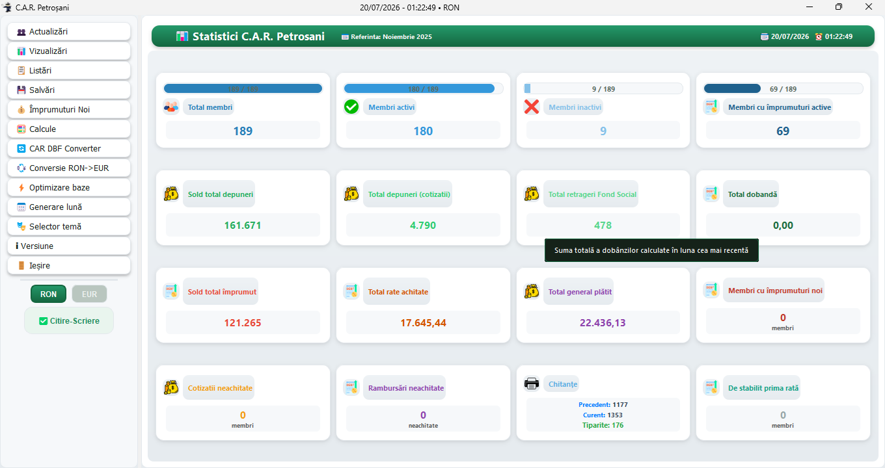
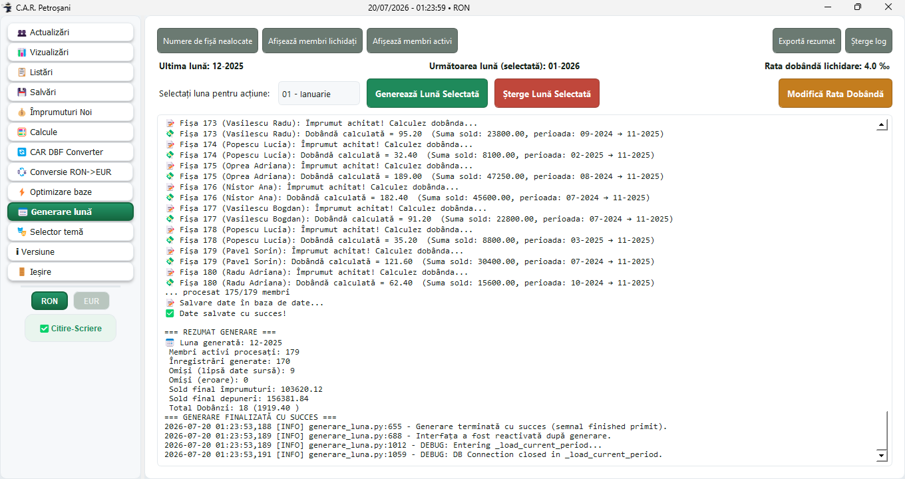
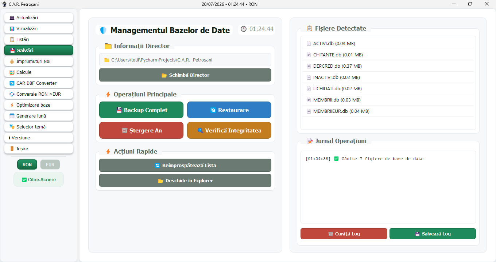

<h1 align="center">C.A.R. Petroșani</h1>

<p align="center">
  <b>Aplicație desktop pentru gestiunea unei Case de Ajutor Reciproc (C.A.R.)</b><br>
  Membri &middot; cotizații &middot; împrumuturi &middot; dobânzi &middot; dividende &middot; chitanțe &middot; conversie definitivă RON&nbsp;→&nbsp;EUR
</p>

<p align="center">
  <a href="https://github.com/totilaAtila/C.A.R._Petrosani/releases/latest"></a>
</p>

<p align="center">
  
  
  
  
</p>

---

## ⬇️ Descărcare

> **[➜ Descarcă ultima versiune pentru Windows (.zip)](https://github.com/totilaAtila/C.A.R._Petrosani/releases/latest)**

1. Descarcă arhiva `.zip` din pagina de [**Releases**](https://github.com/totilaAtila/C.A.R._Petrosani/releases/latest).
2. Dezarhiveaz-o într-un folder al tău (ex. `C:\CAR`).
3. Rulează **`CARpetrosani.exe`** din folder.

Nu ai nevoie de Python sau de alte instalări — **toate dependințele sunt incluse** în arhivă. La prima pornire, Windows SmartScreen poate afișa un avertisment pentru o aplicație nesemnată: apasă *„Informații suplimentare” → „Executare oricum”*.

---

## ⚠️ IMPORTANT — bazele de date livrate sunt **GOALE**

> **Arhiva conține baze de date RON complet GOALE (fără niciun membru).** Ele trebuie **populate** de tine, prin aplicație (adăugare membri, cotizații, împrumuturi, generare lună etc.). Este comportamentul intenționat — nicio dată reală nu este distribuită.
>
> - **Nu** este inclus fișierul `MEMBRII.zip`. La **prima rulare**, aplicația detectează absența lui și îți oferă crearea bazei de membri + setarea unei **parole** proprii (criptare AES‑256).
> - **Nu** sunt incluse bazele în EUR — ele se obțin ulterior, din aplicație, prin **conversia definitivă RON → EUR**.

---

## 📸 Capturi de ecran

| Statistici (tablou de bord) | Generare lună | Salvări / Backup |
|---|---|---|
|  |  |  |

---

## ✨ Ce face aplicația

- **Membri** — adăugare, actualizare, ștergere, lichidare; istoric complet pe fișă.
- **Sume lunare** — cotizații (depuneri), retrageri din fond, împrumuturi, rate, cu recalcul automat al lunilor ulterioare.
- **Împrumuturi** — acordare, rate, sold, cu instrument ajutător de căutare.
- **Dobândă la stingere** — calculată o singură dată, la achitarea completă a împrumutului (rată configurabilă în ‰).
- **Dividende** — calcul anual pe baza soldurilor și transfer în Ianuarie anul următor.
- **Generare lună** — rostogolirea automată a soldurilor pentru o lună nouă, cu validări de integritate.
- **Vizualizări & listări** — situații lunare / trimestriale / anuale, verificare fișe, chitanțe PDF.
- **Export Excel** securizat (xlsxwriter) și **rapoarte PDF** (reportlab).
- **Sistem dual RON / EUR** — conversie definitivă la cursul fix, cu **arhivă RON doar‑citire** după conversie și comutare live RON/EUR în orice ecran.
- **Backup / restaurare** baze, verificare integritate, optimizare indexuri, conversie DBF.
- **Temă vizuală „Glass Verde Rafinat"** — interfață curată, consistentă, cu selector de teme.

---

## 🚀 Rulare din surse (pentru dezvoltatori)

```bash
git clone https://github.com/totilaAtila/C.A.R._Petrosani.git
cd C.A.R._Petrosani

# (recomandat) mediu virtual
python -m venv venv
venv\Scripts\activate            # Windows

pip install -r requirements.txt
python main.py
```

Necesită **Python 3.11+**. Bazele de date RON goale se pot regenera oricând:

```bash
python tests/genereaza_baze_goale.py        # baze RON goale, fara MEMBRII/EUR
```

---

## 🧪 Teste

Suită de teste automate (calcule financiare, precizie `Decimal`, securitate export):

```bash
pip install -r requirements-dev.txt
pytest -q                                   # 66 de teste
```

Detalii în [`tests/README_TESTS.md`](tests/README_TESTS.md).

---

## 🛠️ Tehnologii

`Python 3.11` · `PyQt5` · `SQLite` · `reportlab` (PDF) · `xlsxwriter` (Excel) · `pyzipper` (AES‑256) · `dbf` · `PyInstaller` (build).

---

## 🔒 Securitate & precizie

- **Criptare AES‑256** a bazei de membri (`pyzipper`), cu parolă aleasă de utilizator.
- **Export Excel prin `xlsxwriter`** (migrare de la openpyxl) — elimină CVE‑2023‑43810 (XXE) și CVE‑2024‑47204 (ReDoS).
- **Precizie financiară cu `Decimal`** peste tot — fără erori de rotunjire.

---

## 📄 Licență

Distribuit sub licența **MIT** — vezi [`LICENSE`](LICENSE).
